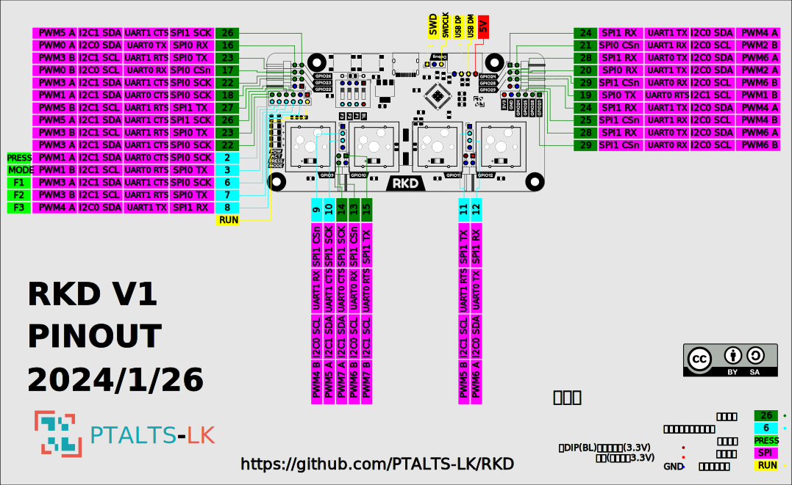

# RKD文档

[Visual-BOM_gerber](Visual-BOM_gerber) 项目元件摆放位号的可视化BOM和gerber文件

[BOM.md](BOM.md) 项目的物料清单

[thonny_dev.md](thonny_dev.md) 更改键位和进行开发的说明（使用Thonny,不推荐用于修改键位）

[key_map.md](key_map.md) 按键对应键值的说明

[MAKE.md](MAKE.md) 制作注意事项

[Wire-key-positioning.md](Wire-key-positioning.md) 关于如何焊接钢丝键轴固定

[cdc_setting.md](cdc_setting.md) 通过串口来设置键位的说明

[RKD.dxf](RKD.dxf) 外壳切割文件

## 引脚图

## 建议

**欢迎对文档提出建议或纠错**

