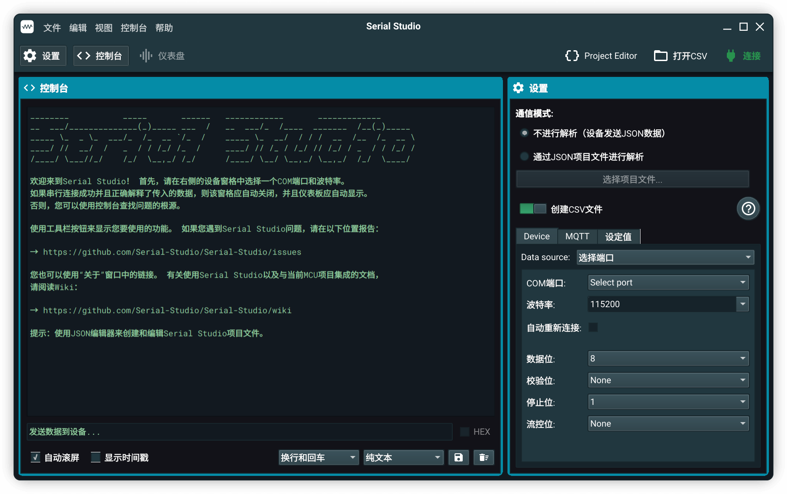
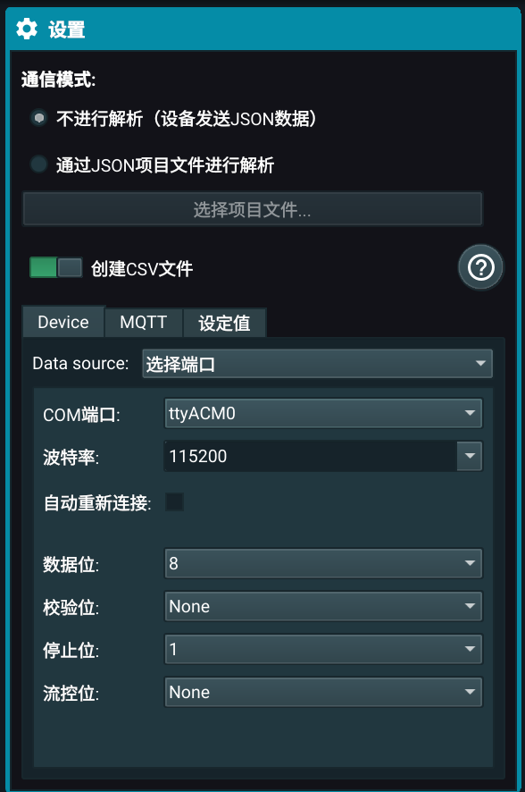
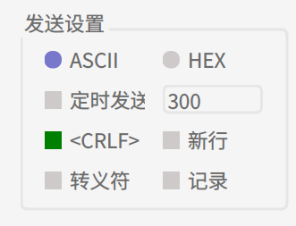
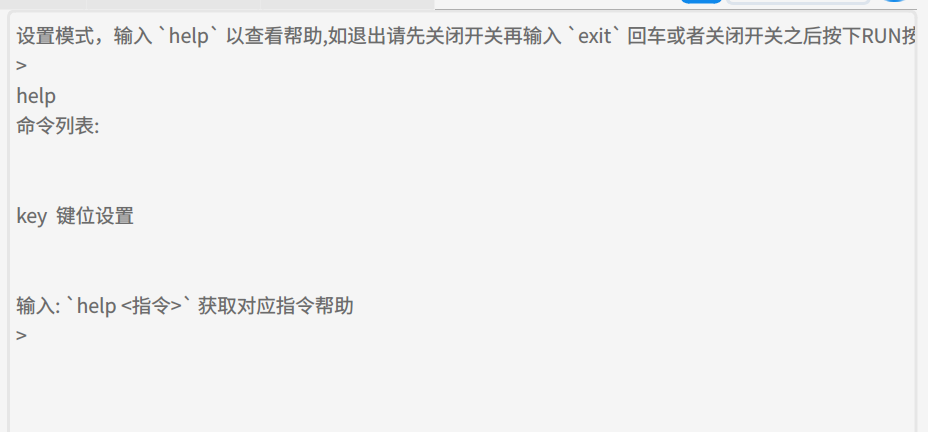
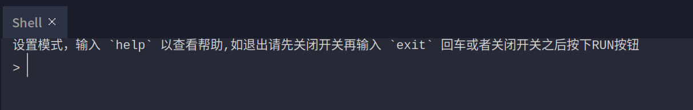
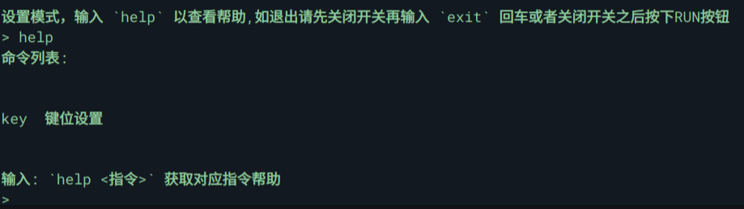

# 使用串口进行键位修改

最近的主控更新中更新了基于串口的指令设置方式（目前只支持更改按键）

支持PC（Windows,Linux,OSX）端以及Android端

## 安装串口通信软件

如果你有其他的串口软件并且会使用,可以不用完全按照下文来做

### PC端

请根据自己的平台前往COMTool的[Sourceforge](https://sourceforge.net/projects/comtool/files)下载安装文件

- Windows用户请下载`comtool_windows_<COMTool版本>.7z`
- Linux用户请下载`comtool_ubuntu_<COMTool版本>.tar.xz`结
- OSX用户请下载`comtool_macos_<COMTool版本>.dmg`

### Android端

请前往F-droid或者Google Play下载`Serial USB Terminal`

你还需要一根OTG线

## 使用串口通信软件连接RKD

连接之前确保RKD的`F3`没有上拨,如果上拨了,请拨下之后按下`RUN`按钮

### PC端 (COMTool)

使用调试线连接PC与RKD

连接之后打开`COMTool`



点击这个图标来设置语言，然后点击`Yes`来确认重启



`连接`面板配置:
- 打开`dtr`
- 点击`端口`下拉框来选择端口,应选择带有`RKD`字样的端口
- 其余保持默认


`发送设置`面板配置:
- 勾选`新行`
- 其余保持默认



点击`连接`面板中的`打开`来连接到端口


之后上拨RKD的`F3`,此时接收面板应输出以下内容则证明连接成功


在发送面板输入`help`,然后按下右边的纸飞机(发送)按钮,接收面板内容应如下



### 使用Thonny的shell来修改 (PC端)

先按照[thonnt_dev.md](thonny_dev.md)中的方法来配置thonny

然后使用调试线连接PC与RKD

打开`Thonny`,然后拨上RKD的`F3`,此时应该出现



进入设置模式成功

### Android端 (Serial USB Terminal)

使用OTG线+调试线连接RKD与Android设备

- 如果连接没有反应（RKD的电源指示灯`POW`和连接指示灯`ACT`未亮起）

  则有可能你的手机需要在设置中手动开启OTG功能，如何开启请根据自己的手机品牌型号自行百度

连接之后打开`Serial USB Terminal`


点击右上角的连接图标


此时应该会弹出一个授权窗口,点确定

然后上拨RKD的`F3`


如果出现以上内容则证明连接成功

## 进行键位修改

可以先输入`help`来查看可用的命令



目前只有`key`,用于获取键位设置和修改键位

可以输入`help <指令>` (不需要添加尖括号) 来查看对应指令的参数帮助

### 命令

可以通过`key getKeyList`来获取所有按键所对应的键名,`key getKeyMap`来获取键值

然后通过`key setKeyValue`来设置键的映射:
- 语法：`key setKeyValue <键名> <键值1> <键值2> ....`
  一次只能设置一个键名对应的键值,可以有多个键值(最多六个,可以实现组合键)
  修改的时候,注意RKD上`F1` `F2`的状态,这个两个开关决定了修改哪个预设组,用二进制的方式来设置预设组,上拨为1,下拨为0

  比如:
  ```
  F2  F1
  上  下
  ```
  对应的就是3号预设
  ```
  F2  F1
  下  下
  ```
  对应1号预设
  
  对命令`key getKeyGroupValue`以及`key getKeyValue`同样生效

  在非设置模式下也是通过这个方式来切换预设组

  当boot_mode为0时才有效,为1时不支持多预设切换(只有一号预设组),目前boot_mode写死在了主控代码中(普通用户不用理会)

`key getKeyGroupValue`和`key getKeyValue`:
- 用于获取整个当前预设组或者当前预设组特定键名对应按键键值
  `getKeyValue`需要指定键名,而`getKeyGroupValue`不需要(因为直接获取当前整个组)
